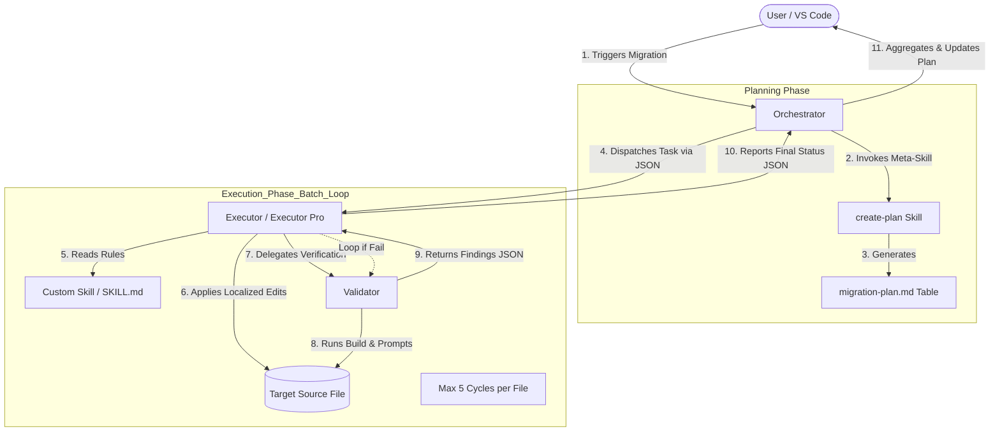

# Agentic Code Migration

> An autonomous Multi-Agent System (MAS) framework for safe, scalable, and verifiable legacy code migration.

Agentic Code Migration orchestrates complex codebase transformations through a specialized triad of AI agents. By enforcing rigorous data contracts, isolated execution environments, and an immutable edit↔validate loop, this framework ensures accurate code refactoring at scale without opportunistic scope creep.

---

## ⚠️ Critical Prerequisite

**This framework is a meta-architecture.** It does not perform generic AI refactoring out of the box. 

Before executing any migration task against your target codebase, you **MUST** analyze your specific technical requirements and use the built-in `create-skill` meta-skill to scaffold and customize a dedicated skill (e.g., upgrading a specific framework version or migrating DTO annotations). Running the system without a highly tailored skill will result in routing blocks or validation failures.

---

## ⚙️ VS Code Configuration

Since this framework utilizes a multi-layered agent workflow (Orchestrator → Executor → Validator) that may run for multiple cycles to ensure code correctness, you **MUST** update your VS Code / Copilot Chat settings to allow deeper agent interactions.

Add the following configurations to your `settings.json`:

```json
{
  "chat.agent.maxRequests": 5000, # 50 by default
  "chat.subagents.allowInvocationsFromSubagents": true
}

```

* **`chat.agent.maxRequests`**: Increased to prevent the context loop from timing out during multi-file batch migrations or intensive edit↔validate cycles.
* **`chat.subagents.allowInvocationsFromSubagents`**: Must be set to `true` to enable the multi-agent delegation cascade (Orchestrator invoking Executors, and Executors invoking the Validator).

---

## 🧠 Core Architecture

This framework operates on a strict separation of concerns, enforcing an immutable verification loop where no agent is allowed to grade its own work.



### Agent Roles & Boundaries:

1. **The Orchestrator (The Planner)**
* **Role:** Project or feature-level dispatcher.
* **Boundaries:** Acts purely as a routing and aggregation layer. **Never** reads the full target source files or edits them directly to protect context windows.


2. **The Executors (The Workers - Standard / Pro)**
* **Role:** File-level migration workers. Standard tier handles single-pass transformations; Pro tier handles complex logic rewrites.
* **Boundaries:** Applied to exactly one target file per invocation. **Cannot** verify its own work.


3. **The Validator (The Gatekeeper)**
* **Role:** Read-only file-level verifier.
* **Boundaries:** Strictly **read-only** with no edit tools. Runs compiler diagnostics, build tools, and skill-specific prompts to return a structured finding report (`pass`, `fail`, `inconclusive`).


---
## Design Rationale

We designed this framework around three core engineering principles that prioritize correctness, repeatability, and efficient validation during large-scale code migrations.

1. Shift effort left to reduce verification cost

    - Empirical experience shows that most migration effort is consumed by testing, debugging, and verification, not by the initial edit. By improving the quality and precision of edits during the migration phase (smaller, more targeted changes, and stricter rule application), we reduce downstream validation cycles and rework. To operationalize this, the architecture embeds a `Validator` as a sub-agent of the `Executor` to form a tight edit→validate feedback loop that surfaces issues early and lowers overall iteration cost.

2. Independent contexts with efficient handoff

    - The `Validator` runs in an isolated execution context, separate from the `Executor`, to avoid self-assessment bias and to make validation reproducible and auditable. After validation completes, the `Validator` returns structured findings and minimal metadata to the `Executor`, enabling the `Executor` to resume corrective actions without re-collecting the entire task context. This handoff reduces redundant context gathering and accelerates repair cycles.

3. Predictability through strict separation of privilege (an explicit trade-off)

    - We enforce strict separation of responsibilities and access scopes across agents to ensure consistent, auditable behavior—important for reproducible automation. This constraint reduces agent flexibility, which is an intentional engineering trade-off: code migration is largely patterned work rather than open-ended creative synthesis. Constraining agent actions lowers reasoning complexity and improves repeatability, but increases the burden of context management when a codebase cannot be loaded into a single context. Operational mitigations—metadata contracts, chunked contexts, bounded retries, and explicit data contracts—help manage that complexity.

Overall, the design favors predictability and verifiability over unconstrained flexibility, optimizing for scalable, repeatable migration workflows rather than ad-hoc exploratory edits.

## 📂 Project Structure & Skills

The framework is fully modular. All migration rules and validation logic reside within the `skills/` directory.

```text
skills/
├── create-skill/       # Meta-skill: Scaffolds a new migration skill
├── create-plan/        # Meta-skill: Generates a batch execution plan
├── your-custom-skill/  # Custom skill tailored via 'create-skill'
│   ├── SKILL.md        # The main entrypoint and routing contract
│   ├── reference/      # Prompt rules for the Executor
│   │   └── 01-rule.prompt.md
│   └── validate/       # Validation rules for the Validator
│       ├── config.yaml
│       ├── scripts/    
│       └── prompts/    

```

### Extending the Framework

To build a new skill for a specific migration task:

1. Invoke the `create-skill` meta-skill.
2. Provide the `new_skill_name` and `new_skill_description` via context.
3. Hydrate the generated `reference/` and `validate/` directories with your specific migration prompts and script validations.

---

## 🚀 Getting Started

1. Clone the repository:
```bash
git clone [https://github.com/Wangmz-1211/agentic-code-migration.git](https://github.com/Wangmz-1211/agentic-code-migration.git)

```


2. Configure your VS Code `settings.json` as outlined in the **System Configuration** section.
3. Scaffold your first concrete migration rule using `create-skill`.
4. Initialize a batch execution by pointing the Orchestrator to your target file list with `create-plan`.

---

## 🤝 Contributing

Contributions, issues, and feature requests are welcome! If you are designing new migration skills, please ensure they adhere to the strict `SKILL.md` JSON contracts defined in the architecture.